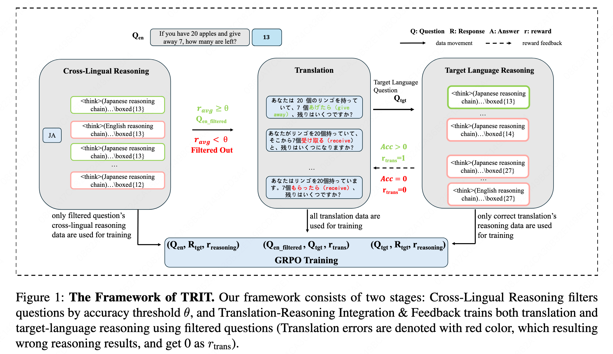
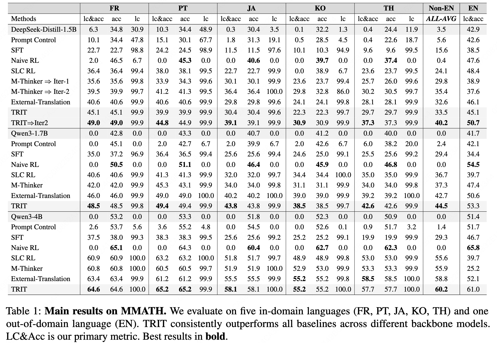
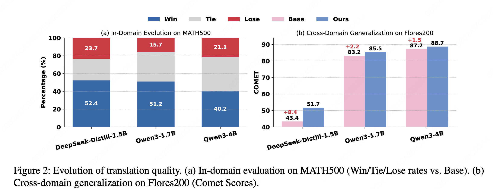
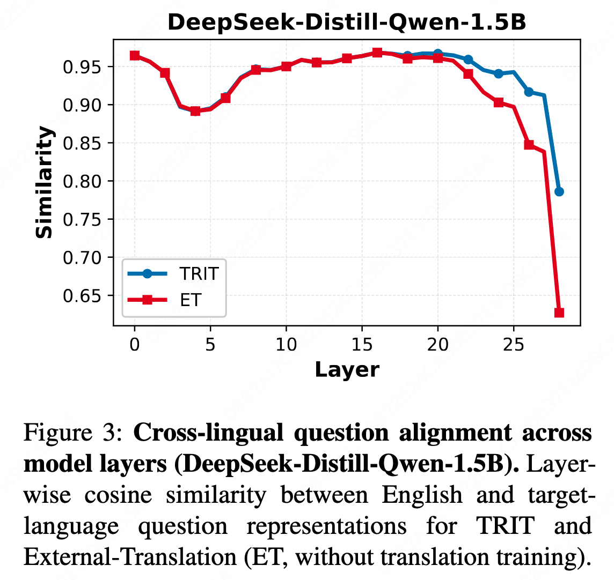
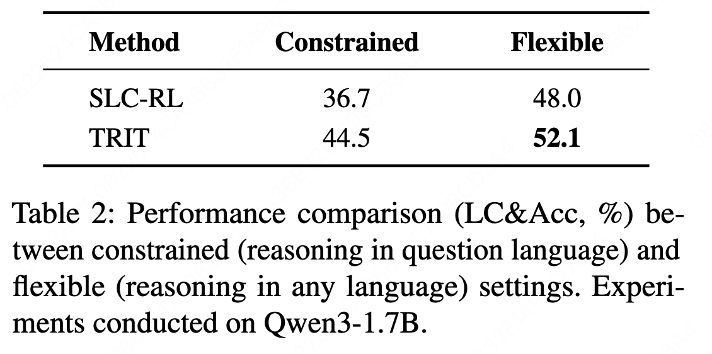
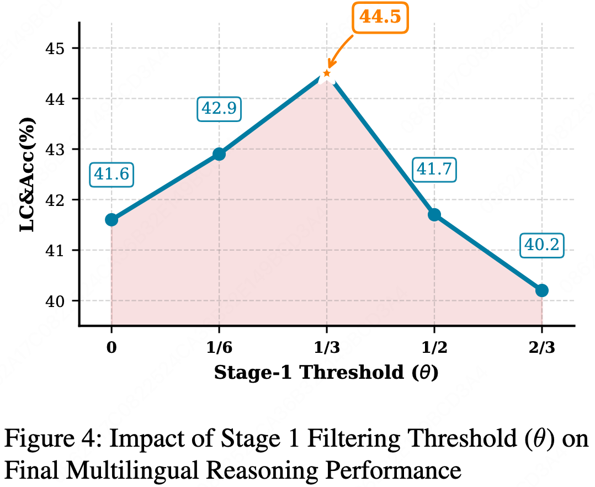

# TRIT: Translation-Reasoning Integrated Training

**[Paper](https://arxiv.org/abs/XXXX.XXXXX) | [Data](https://huggingface.co/datasets/NJUNLP/TRIT-Data)**

Official implementation of "Self-Improving Multilingual Long Reasoning via Translation-Reasoning Integrated Training"


---

## 🔥 Overview

Long reasoning models often struggle with multilingual settings: they tend to reason in English for non-English questions, and when forced to reason in the question language, performance drops substantially. **TRIT** addresses this by integrating translation training directly into multilingual reasoning through a self-improving reinforcement learning framework.

### Framework Overview



**Key Innovation:** TRIT creates a closed feedback loop where:

- Translation provides multilingual question data for reasoning
- Reasoning accuracy provides quality signals for translation
- No external feedback or additional multilingual data required

**Two-Stage Process:**

1. **Cross-Lingual Reasoning:** Filter questions by accuracy threshold to ensure reliable feedback
2. **Translation-Reasoning Integration:** Train translation and reasoning jointly, creating mutual improvement

All tasks are optimized using **GRPO** (Group Relative Policy Optimization).

---

## 🎯 Key Results

### Main Performance 



TRIT achieves:

- **+7 percentage points** average improvement over SLC-RL baseline across three models
- **+5 percentage points** over M-Thinker on Qwen3 models
- **Near-perfect language consistency** (>99%) across all settings

### Translation Quality Improvement 



TRIT improves translation quality both in-domain and out-of-domain:

- **In-domain (MATH500):** Up to 3.3:1 win-to-loss ratio vs baseline
- **Out-of-domain (FLORES-200):** Up to **+8.4 COMET points**

### Cross-lingual Question Alignment



Translation training induces question-level alignment:

- **+15.9 percentage points** improvement in final-layer similarity (DeepSeek-Distill-1.5B)
- Substantially higher alignment across all model layers compared to External-Translation baseline

---

## 📊 Additional Analysis

### Flexible Reasoning Setting



TRIT remains effective even when reasoning language is not constrained:

- **52.1%** accuracy when models can reason in any language (Qwen3-1.7B)
- **+4.1pp** improvement over SLC-RL in flexible setting
- Demonstrates TRIT improves question understanding, not just language consistency

### Threshold Sensitivity 



Optimal filtering threshold θ = 1/3 balances noise reduction and data retention.

---

## 🚀 Getting Started

### Installation

```bash
git clone https://github.com/NJUNLP/TRIT.git
cd TRIT
pip install -r requirements.txt
```

### Data

Download training data from [Hugging Face](https://huggingface.co/datasets/NJUNLP/TRIT-Data).

### Training

**Stage 1: Cold-start Training**

We use [LlamaFactory](https://github.com/hiyouga/LLaMA-Factory) for supervised fine-tuning. Configuration: `scripts/sft.yaml`
```bash
llamafactory-cli train scripts/sft.yaml
```

**Stage 2: TRIT Training**

We use [VeRL](https://github.com/volcengine/verl) for reinforcement learning. Example script: `scripts/example.sh`
```bash
bash scripts/example.sh
```

---

## 💡 Key Insights

1. **Translation-Reasoning Integration is the Core Innovation**
   - Translation training improves question understanding
   - Reasoning feedback guides translation quality
   - Joint optimization creates self-improving loop

2. **Question-Level Alignment Matters**
   - TRIT induces aligned cross-lingual representations
   - External translations alone don't achieve this alignment
   - Alignment correlates with reasoning improvements

3. **Framework is Flexible and Robust**
   - Works across models with varying multilingual capabilities
   - Effective in both constrained and flexible reasoning settings
   - Supports iterative training for continual improvement

---

## 🙏 Acknowledgments

This work is supported by National Science Foundation of China (No. 62376116), research project of Nanjing University-China Mobile Joint Institute (NJ20250038), and the Fundamental Research Funds for the Central Universities (No. 2024300507).

We thank the authors of DAPO-MATH, M-Thinker, and GRPO for their open-source contributions.

---

## 📄 License

This project is licensed under the MIT License - see the [LICENSE](LICENSE) file for details.

